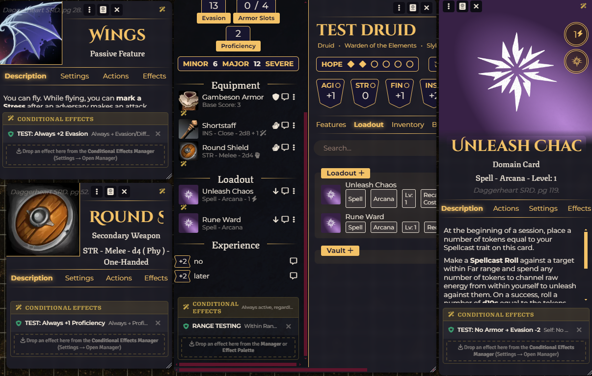
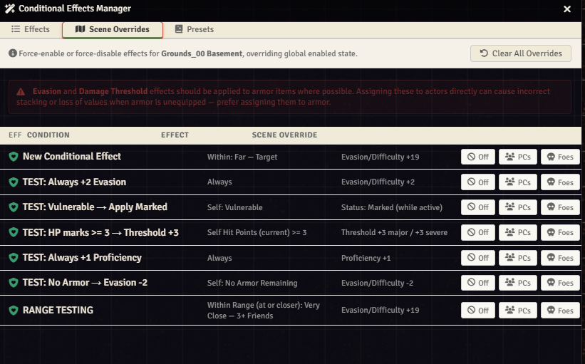
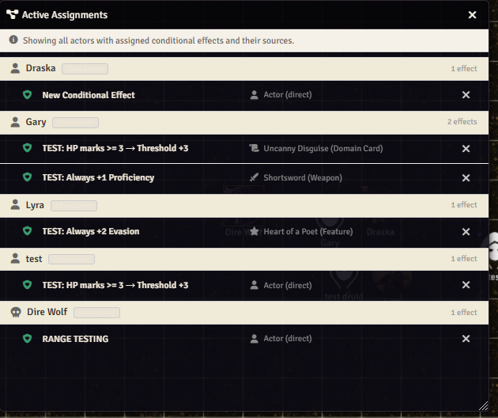
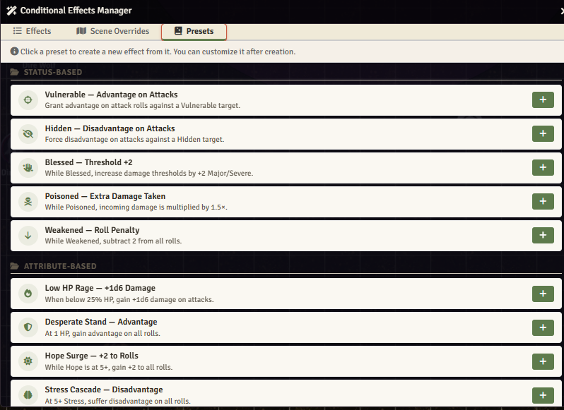
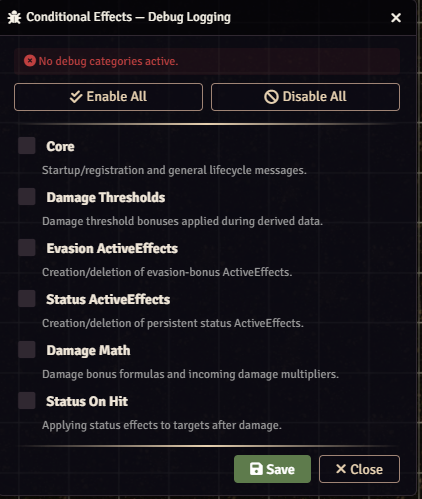
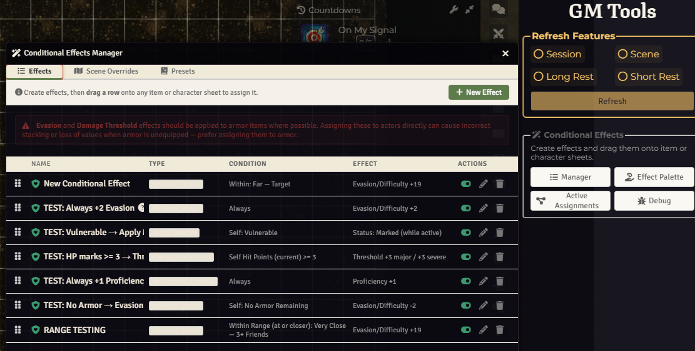
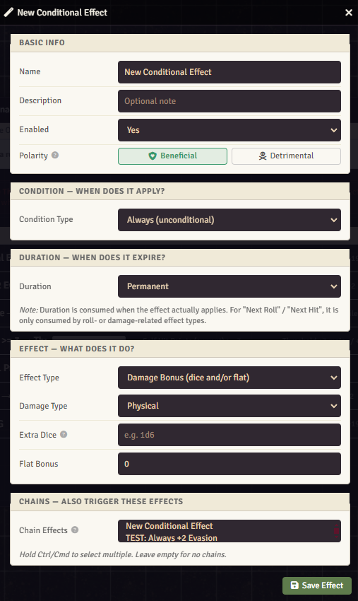

# Daggerheart: Conditional Effects

Conditional Effects for Daggerheart in FoundryVTT (Foundryborne)

A flexible rule-based effects engine for the [Daggerheart](https://darringtonpress.com/daggerheart/) TTRPG system on FoundryVTT v13. Define conditions, choose an effect, and the module handles the rest automatically — modifying rolls, damage, evasion, thresholds, proficiency, statuses, and more based on live game state.

## Installation

Copy and paste this link into Foundry > Add-on Modules > Install Module > Manifest URL:

```
https://raw.githubusercontent.com/Tristyn159/dh-cond-fx/main/module.json
```

---

## Features

### Conditional Effects Manager
- Create, edit, enable/disable, and delete conditional effects from a central GM window
  - Chain effects - create a conditional effect that links to other conditional effects
- Drag-and-drop effects onto items (weapons, armor, domain cards, features) or directly onto actor sheets to assign them
- Full CRUD with real-time UI updates
<p align="center">
  
</p>

### Effect Palette
- Compact drag-and-drop palette showing all defined effects at a glance
- Drag effects from the palette onto any item or character sheet to assign

### Scene Overrides
- **PCs** — Force-enable an effect for all player characters in the active scene
- **Foes** — Force-enable an effect for all adversaries in the active scene
- **Off** — Force-disable an effect scene-wide, overriding global enabled state
- **Clear All Overrides** — Reset all scene overrides in one click
<p align="center">
  
</p>

### Active Assignments Viewer
- See every actor that currently has conditional effects and exactly where each effect comes from (scene override, item, or direct actor assignment)
- Click actor names to open their sheets
- Click item sources to open the item's sheet
- Remove/unassign effects from their source directly from the viewer
- Auto-refreshes in real time when assignments change
<p align="center">
  
</p>

### Presets Library
- Built-in library of pre-configured effects organized by category (Status-Based, Attribute-Based, Trigger-Based, Combat Utility)
- One-click creation — click a preset to instantly create a new effect from it, then customize as needed
- Includes presets for common patterns like Vulnerable advantage, Low HP Rage, Fear-Fueled damage, Enchanted Weapon, Countdown buffs, and more
<p align="center">
  
</p>


### Debug Logging
- Per-category debug toggles (Core, Damage Thresholds, Evasion AE, Status AE, Damage Math, Status On Hit)
- Persisted across page reloads via client settings
- Accessible from the GM Tools menu
<p align="center">
  
</p>

---

## Condition Types

Conditions determine *when* an effect activates. Each effect has one condition:

| Condition | Description |
|---|---|
| **Always** | Unconditional — always active while assigned and enabled |
| **Subject has Status/Condition** | Triggers when self or target has a specific status (Vulnerable, Hidden, Blessed, Burning, Poisoned, etc.) |
| **Subject Attribute Value** | Triggers when an attribute meets a threshold (e.g., HP <= 25%, Stress >= 5, Hope >= 3) |
| **Attack Range** | Filters by attack range (Melee, Close, Far, etc.) |
| **Weapon Slot** | Filters by weapon slot (Primary, Secondary, Any) |
| **Incoming Damage Type** | Filters by damage type received (Physical, Magical, Any) |
| **When Subject Takes Damage Threshold** | Triggers when subject takes Minor, Major, or Severe damage |
| **When Subject Inflicts Damage Threshold** | Triggers when subject deals Minor, Major, or Severe damage |
| **When Subject Rolls with Fear** | Triggers on a duality roll resulting in Fear |
| **When Subject Rolls a Critical Success** | Triggers on a Critical Success (matching dice) |
| **When Subject Spends Hope** | Triggers when the subject's Hope decreases |
| **When Subject Marks an Armor Slot** | Triggers when an armor slot is marked |
| **Subject Has No Armor Remaining** | Active while all armor slots are marked |

### Supported Attributes
Hope, Stress, Hit Points (current, max, %), Evasion, Proficiency, Armor Score, and all six traits (Agility, Strength, Finesse, Instinct, Presence, Knowledge).

---

## Effect Types

Effects determine *what happens* when the condition is met:

| Effect | Description |
|---|---|
| **Damage Bonus** | Add dice (e.g., 1d6, 2d4) and/or flat bonus to damage. Filter by damage type (Physical, Magical, Primary/Secondary Weapon). |
| **Damage Multiplier** | Multiply incoming damage (e.g., x1.5, x2). Filter by damage type. |
| **Damage Threshold Bonus** | Modify Major and/or Severe damage thresholds. Best assigned to armor items. |
| **Evasion / Difficulty Bonus** | Flat bonus or penalty to Evasion (PCs) or Difficulty (Adversaries). |
| **Proficiency Bonus** | Modify Proficiency while the condition is met. Synced via ActiveEffects. |
| **Roll Bonus** | Flat bonus or penalty to rolls. Filterable by **Trait** (Agility, Strength, etc.) and **Roll Type** (Action, Reaction). |
| **Grant Advantage** | Grant advantage on rolls. Filterable by Trait and Roll Type. |
| **Force Disadvantage** | Force disadvantage on rolls. Filterable by Trait and Roll Type. |
| **Apply Status to Target on Hit** | Apply a status (Vulnerable, Restrained, etc.) to the target when dealing damage. |
| **Apply Stress to Target on Hit** | Force the target to mark Stress when dealing damage. |
| **Apply Status to Subject** | Apply a status to the effect owner while the condition is true; automatically removed when the condition becomes false. |

### Roll Filters
Roll Bonus, Advantage, and Disadvantage effects can optionally be filtered by:
- **Trait**: Any, Agility, Strength, Finesse, Instinct, Presence, Knowledge
- **Action Type**: Any, Action Roll, Reaction Roll

---

## Duration Modes

Control how long an effect lasts after triggering:

| Duration | Behavior |
|---|---|
| **Permanent** | Active as long as the condition is met |
| **Once** | Consumed after first use |
| **Limited Uses** | Consumed after N uses |
| **Next Roll Only** | Consumed on the next roll |
| **Next Hit/Damage Only** | Consumed on the next damage event |
| **Until End of Combat** | Expires when the current combat encounter ends |
| **Countdown** | Ticks down on a chosen event (each round, each roll, each time attacked, each time damaged) and expires when the count reaches 0 |

---

## Assignment Sources

Effects can be assigned to actors through multiple paths:

1. **Item Assignment** — Drag an effect onto a weapon, armor, domain card, or feature. The effect is active while the item is equipped (weapons/armor), in the loadout (domain cards), or always (features).
2. **Actor Assignment** — Drag an effect directly onto a character or adversary sheet. Always active for that actor.
3. **Scene Overrides** — Force-enable an effect for all PCs and/or all adversaries in the active scene via the Manager's Scene Overrides tab.

Effects from all sources are deduplicated and combined automatically.

---

## How To

Open the Manager from the **GM Tools** menu (the Daggerheart sidebar menu) or from **Game Settings > Module Settings**.

<p align="center">
  
</p>

Create conditional effects, then drag-and-drop them onto PCs, weapons, armor, domain cards, or features.

<p align="center">
  
</p>

Use Scene Overrides to force-enable effects for all PCs or all adversaries, or force-disable effects scene-wide.


---

## Known Limitations

- **Evasion and Damage Threshold** effects work best when assigned to armor items. Assigning directly to actors can cause incorrect stacking or loss of values when armor is unequipped. The Manager UI warns about this.
- **Range conditions** are partially implemented and may not work in all scenarios.
- **Apply Status** effects ignore duration modes — they are purely condition-truth-based (applied when true, removed when false). The editor will warn and reset to Permanent if you choose a different duration.
- **Dice formula validation** is performed at save time. Invalid formulas (like "abc") will be rejected with an error notification.

---

## Compatibility

- **FoundryVTT**: v13+
- **Daggerheart System (Foundryborne)**: v1.7.1+
- **Sheet Support**: Default sheet, DH+ sheet, Sleek UI

---


## License

* **Code License:** GNU GPLv3.
