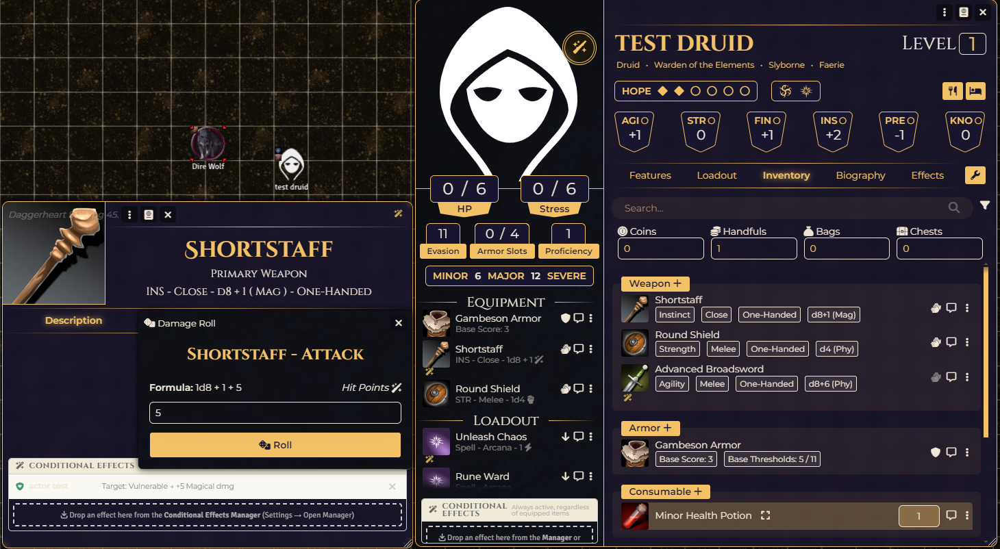
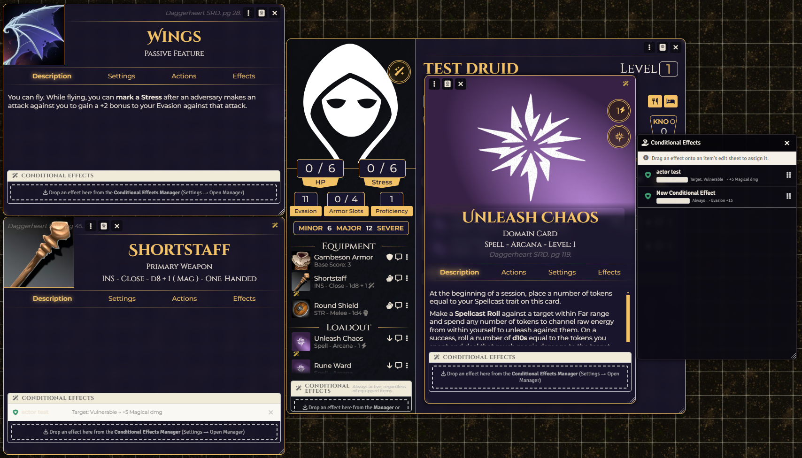

# Daggerheart: Conditional Effects

Conditional Effects for Daggerheart in FoundryVTT (Foundryborne)

<p align="center">
  
</p>

# Features

*   **Scene Overrides:** GMs can disable effects that have been added to PCs and items, per scene. GMs can also force-enable effects for all PCs in a scene without adding them to the PCs or items.
*   **Match From a List of Conditionals:** always, owner/target has a specific status/condition (vulnerable, restrained..), owner/target has a certain attribute value (hp, hope, stress, evasion..).
*   **Add or Remove with Effects:** hit/duality, damage, thresholds, evasion ; apply statuses on hit, grant advantage/disadvantage.
*   **Polarity: Beneficial or Detrimental:** Make effects detrimental, either removing stats or giving stats to attackers (cursed items?)

# Known Bugs/Issues
*   Evasion and Threshold modifiers can simply not work if not equipped on a piece of Armor. Reload (f5) to fix
   *   Threshold modifiers will disappear if armor is unequipped and reequipped. Reload to fix.
*   Range checking conditionals were causing issues, currently removed.

# How To 

Open Manager under GM Tools menu (or game settings) to create effects.

<p align="center">
  
</p>


Create Conditional Effects and dragon/drop them on to PCs, Weapons, Armor, Domain Cards, or Features

<p align="center">
  
</p>
<p align="center">
  
</p>


To forcibly add an effect to all PCs in a scene, use the PCs button in the Scene Overrides menu
<p align="center">
  
</p>


# Installation

1. Copy  and paste this link into Foundry ⟶ Add-on Modules ⟶ Install Module ⟶ Manifest URL:

```
 https://raw.githubusercontent.com/Tristyn159/dh-conditional-effects/main/module.json

```
 

# License

* **Code License:** GNU GPLv3.
